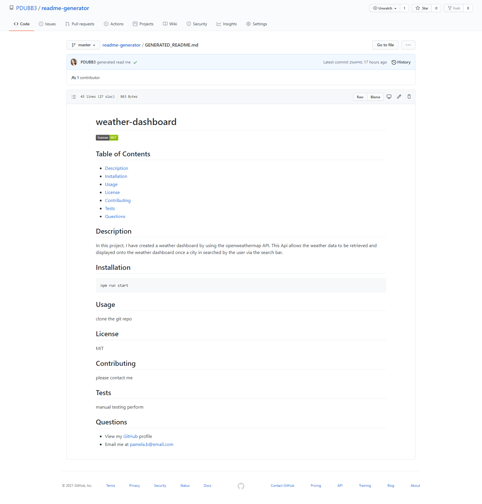

## Readme-Generator

<h2> Table of Contents </h2>

- [Project Link](#project-link)
- [Description](#description)
- [What did we do](#what-did-we-do)
- [Getting Started](#getting-started)
- [Screenshots](#screenshots)
- [Walkthrough Video](#walkthrough-video)

## Project Link

Click [here](https://pdubb3.github.io/readme-generator/) to view project on Github pages

## Description

In this project, I have created a command-line application that dynamically generates a professional README file from a users input using the inquirer package and Node.js.

## What did we do?

Create a README generator so I can quickly create a professional README for a new project.

- [x] Provide a command-line application that accepts user input
- [x] When I am prompted for information about my application repository, then a high-quality, professional README is generated with the title of my project and sections entitled Description
- [x] When I enter my project title, then this is displayed as the title of the README
- [x] When I enter a description, installation instructions, usage information, contribution guidelines and test instructions then this is added to the correlated sections
- [x] When I choose a license for my application from a list of options, then a badge for that license is added near the top of the README
- [x] When I enter my Github username, this is added as a link to my github profile under the section entitled Questions
- [x] When I enter my email address, this is added as a link to my github profile under the section entitled Questions with instructions on how to reach me.
- [x] When I click on the links in the Table of contents, then I am taken to the corresponding section of the README.

## Getting started

- Create a new GitHub repository called readme-generator
- Clone github project onto your local machine
- Navigate into the project
- Open the project into VS code

```
git clone git@github.com:PDUBB3/readme-generator.git
cd readme-generator
code .
```

- Create `.gitignore` file before installing any npm dependencies.
- Include `node_modules/` and `.DS_store/` in the `.gitignore` file.
- Repo to include a `package.json` file by running `npm init -y` when you first set up the project.

Installation

```
npm i

```

Run

```
npm run start

```

Test with coverage

```
npm run test

```

Test with watch

```
npm run test:watch

```

## Screenshots



Click [here](./GENERATED_README.MD) to view example of readme file generated

## Walkthrough Video

Click [here](https://drive.google.com/file/d/1kGHzCdRpyUNATIAsqauTuiXvN0E6A7fK/view?usp=sharing) to view my walkthrough video.
